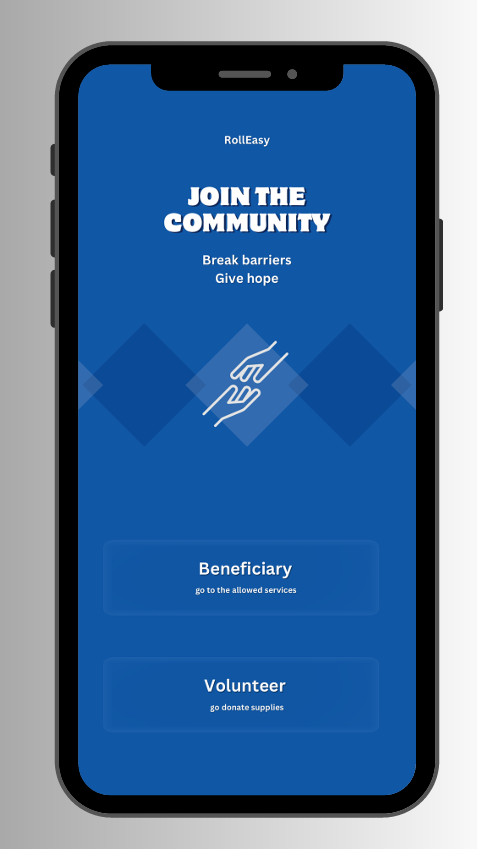
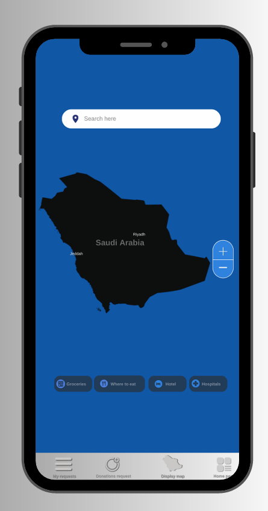

# RollEasy - UI/UX Prototype & Software Engineering Planning ♿

A comprehensive software engineering planning and high-fidelity prototype designed to enhance accessibility and support services for disabled individuals and their community within Saudi Arabia.

## 📊 Project Scope & Achievements
* **62 Interactive Screens:** Successfully designed and delivered a complete high-fidelity system prototype mapping 100% of user workflows and system requirements.
* **Agile/Scrum Lifecycle:** Formulated resource allocation, risk mitigation guidelines, and sprint tracking models across a simulated 20-week lifecycle.
* **Software Quality Control:** Established an end-to-end Quality Control framework using the **PDCA model** to outline strict functional and security testing strategies[cite: 1].

---

## 🚀 Prototype Showcase (Key Interfaces)
*Below are core screens designed for the platform. The complete 62-screen design document is linked below.*

   \quad \quad \quad \quad
  

---

## 📄 Project Deliverables & Specifications
* 📂 **[View Full 62-Page Prototype PDF](RollEasy_Full_Prototype.pdf)**

---

## 🛠️ Skills & Frameworks Demonstrated
* **UI/UX Design:** High-Fidelity Prototyping, Wireframing, User Flow Mapping, and Information Architecture[cite: 1].
* **Software Engineering:** Requirement Analysis, Risk Management, Agile/Scrum Frameworks, and Quality Assurance (PDCA Model)[cite: 1].
* **Project Management Tools:** Microsoft Planner, Agile Sprint Scheduling[cite: 1].
